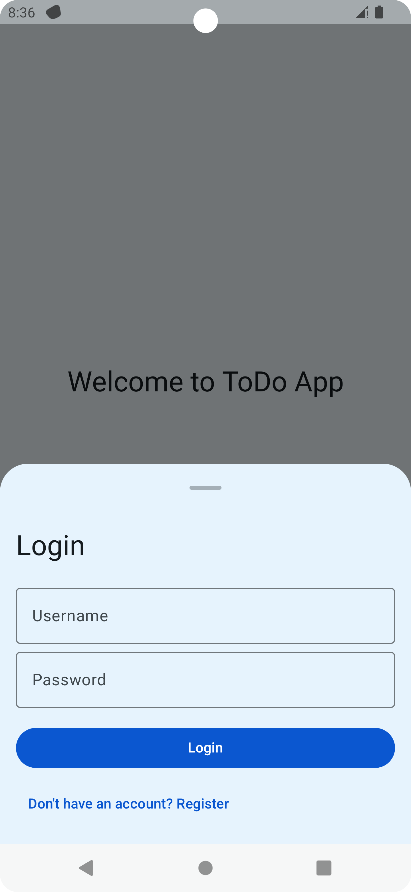
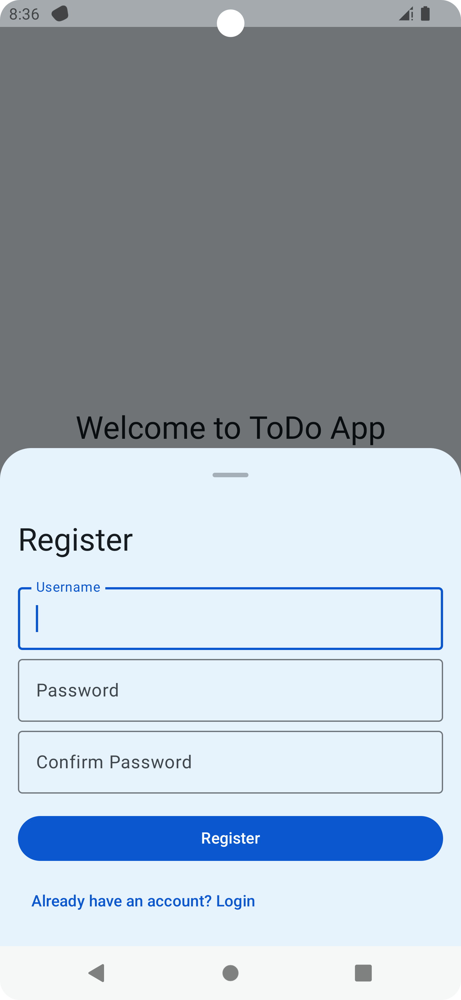
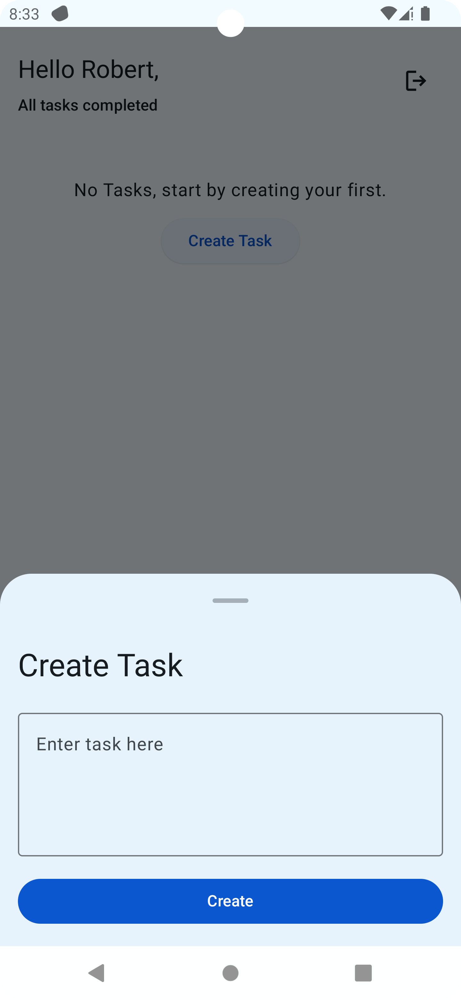
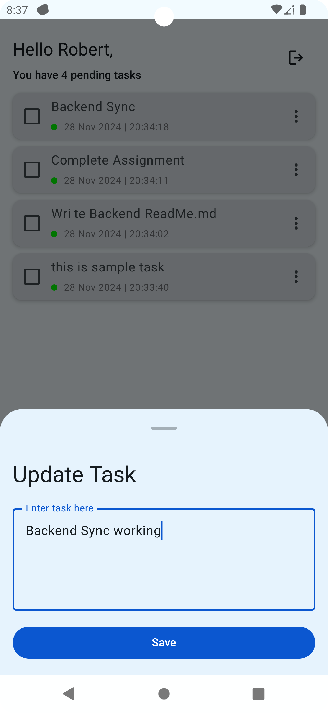
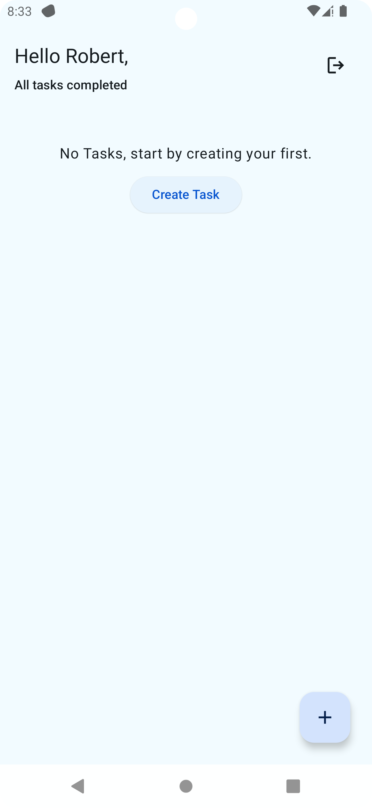
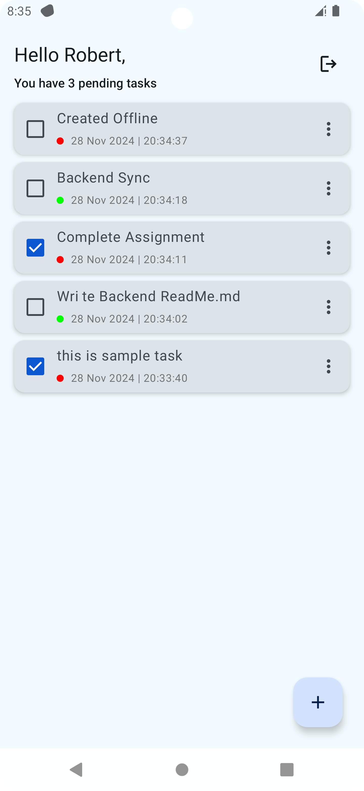
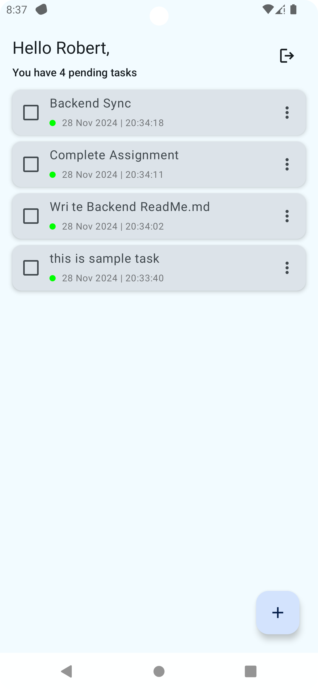
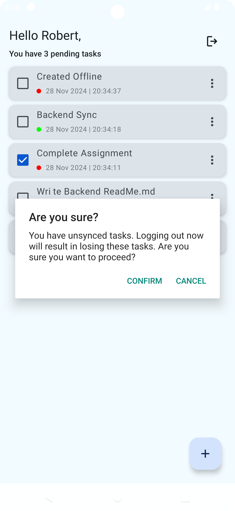

# Task Manager Android App

This is a native Android application that allows users to manage tasks with online/offline synchronization capabilities. The app is built using **Kotlin** and leverages modern Android development practices, including Jetpack Compose, Room Database, Hilt for dependency injection, and Retrofit for network operations.

---

## Features

- **User Authentication**: Login and registration using JWT-based authentication.
- **Task Management**: Create, edit, delete, and view tasks in a list view.
- **Offline Functionality**: Tasks can be created, edited, and deleted offline and are synchronized when connectivity is restored.
- **Modern UI**: Built using Jetpack Compose for a responsive and dynamic user experience.
- **Local Storage**: Stores tasks locally using Room Database.
- **Dependency Injection**: Uses Hilt for efficient dependency management.
- **Background Sync**: Automatically synchronizes tasks with the backend using WorkManager when the network is available.

---

## Screenshots

### Authentication
<div style="display: flex; justify-content: space-around;">
  
  
</div>

### Task List
<div style="display: flex; justify-content: space-around;">
  
  
  
  
  
  
</div>

## Prerequisites

1. **Android Studio** (Ladybug or later)
2. **Minimum SDK**: 24
3. **Gradle**: Kotlin DSL-based configuration
4. **Backend Server**: Ensure the backend server is running (refer to the [backend README](https://github.com/harish32150/TodoITest/tree/master/backend)).

---

## Project Setup

### Step 1: Clone the Repository

```bash
git clone https://https://github.com/harish32150/TodoITest.git
cd TodoITest
```

### Step 2: Configure `local.properties`

Add the backend server URL in the `local.properties` file:

```properties
base_url=https://api.example.com:PORT
```

---

### Step 3: Open the Project in Android Studio

1. Launch Android Studio.
2. Open the project folder.
3. Sync the Gradle files when prompted.

---

### Step 4: Run the Application

1. Connect your device or start an emulator.
2. Build and run the app via Android Studio.

---

## Key Libraries Used

- **Jetpack Compose**: Modern UI toolkit for building native UI.
- **Room**: Local database for offline functionality.
- **Hilt**: Dependency injection.
- **Retrofit + Moshi**: Network calls and JSON serialization.
- **WorkManager**: Background synchronization.
- **Kotlin Coroutines + Flow**: Asynchronous programming.

---

## Features and Usage

### 1. **Authentication**
- Users can register and log in.
- Tokens are stored securely.
- Tokens are passed as headers in API calls.

### 2. **Task Management**
- View tasks in a list view.
- Add, edit, and delete tasks locally.
- Sync tasks with the server when online.

### 3. **Offline Support**
- Tasks are stored in Room Database.
- Automatically syncs changes when connectivity is restored.

---

## Testing the App

### API Integration
Ensure the backend is running and accessible at the configured `base_url`.

### Offline Mode
1. Disable the internet on your device.
2. Create or update tasks.
3. Re-enable the internet and verify the synchronization.

---

## Troubleshooting

- **Gradle Sync Issues**:
    - Verify `local.properties` contains the `base_url`.
    - Sync the project again.

- **Backend Connection Errors**:
    - Ensure the backend is running and the `base_url` is correct.

---

## Future Enhancements

- Add unit and UI tests.
- Support pagination for task lists.
- Implement refresh token functionality.

---